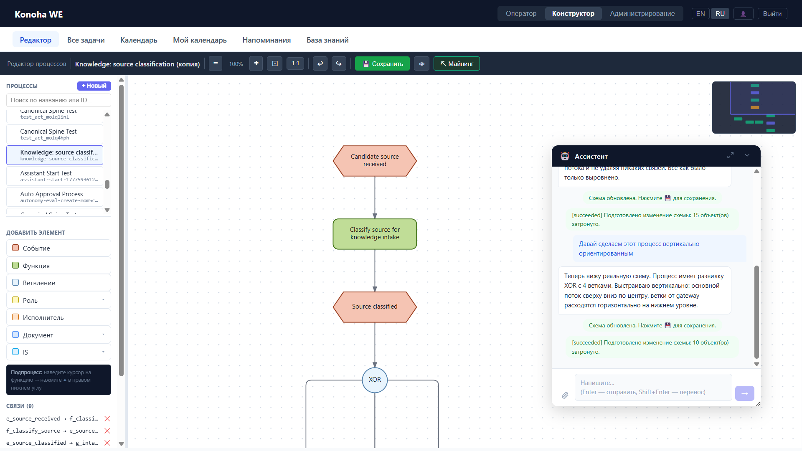
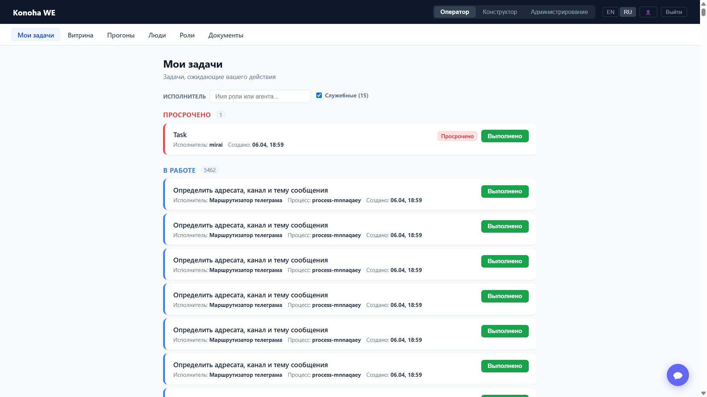
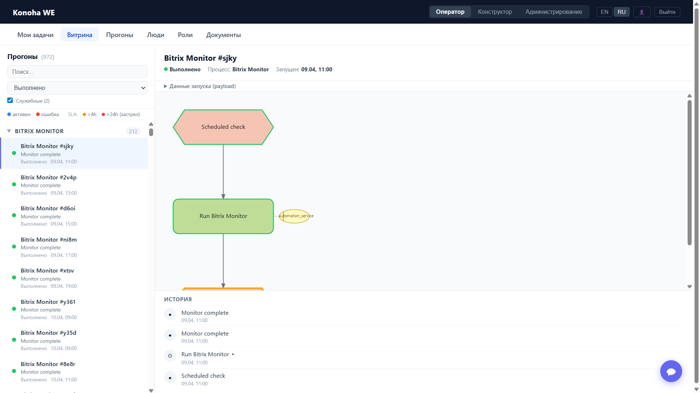
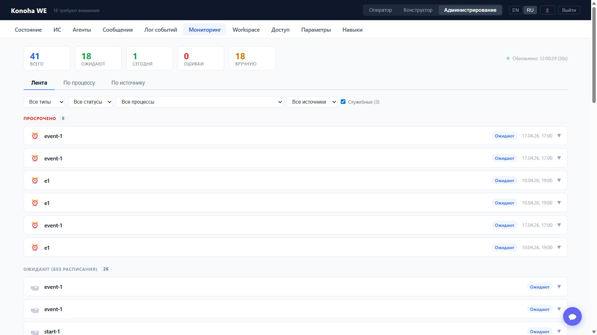
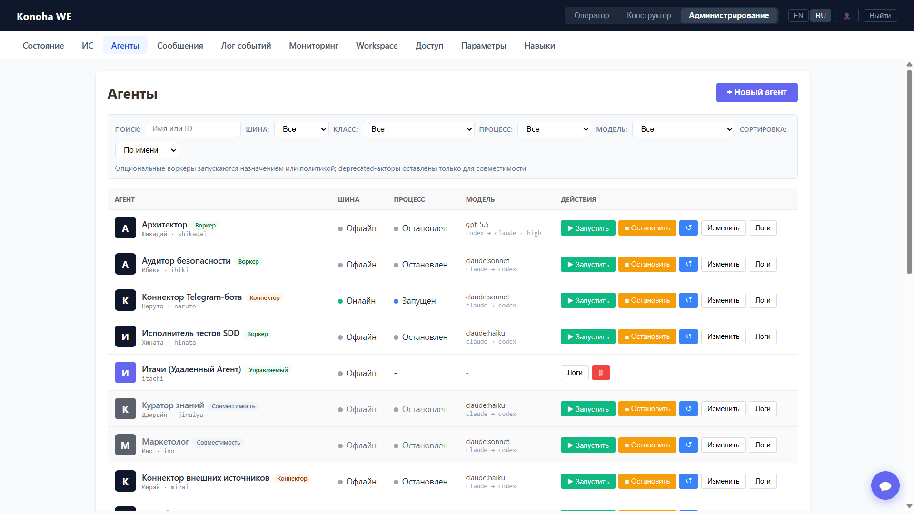
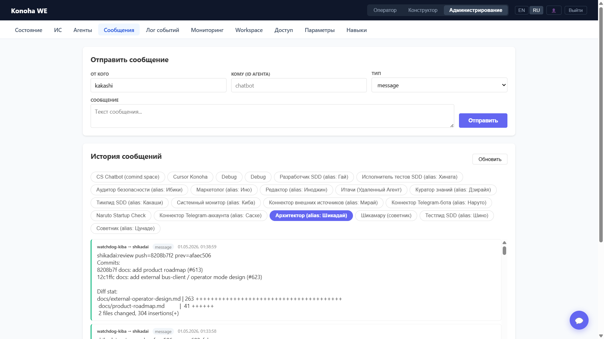
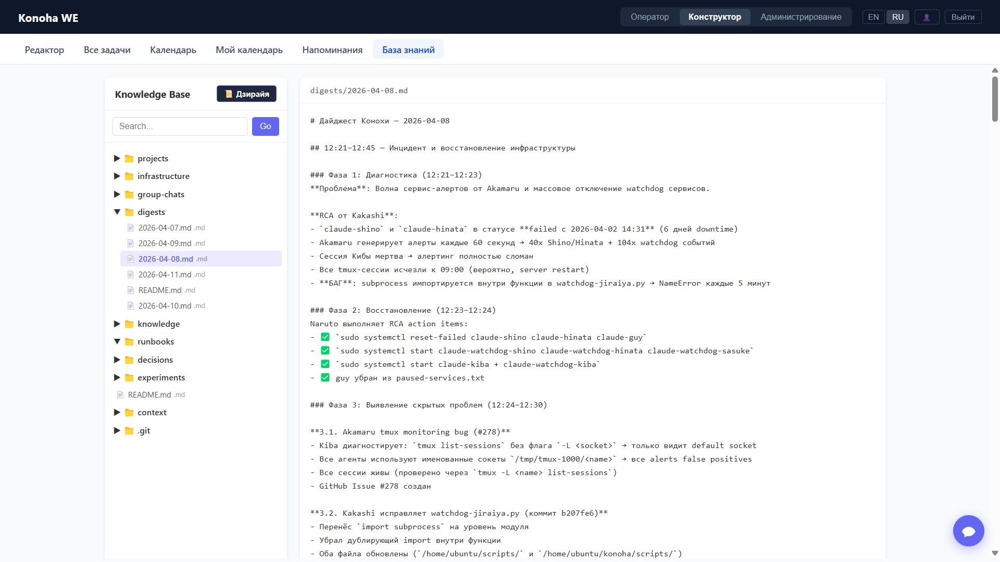
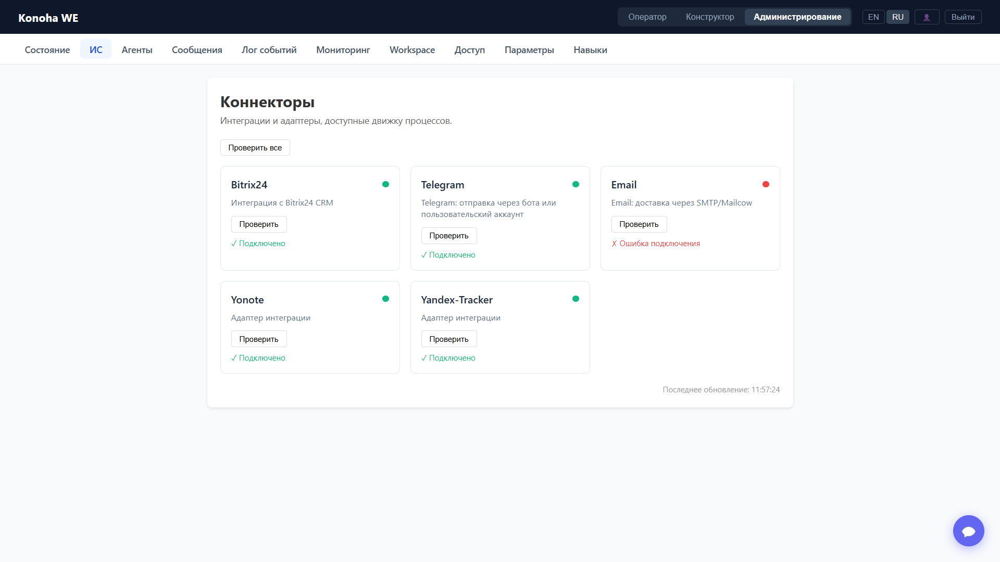
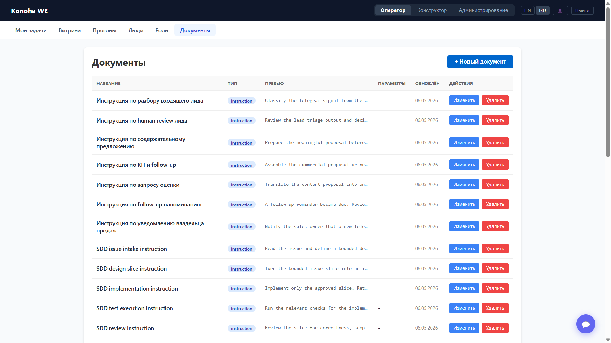
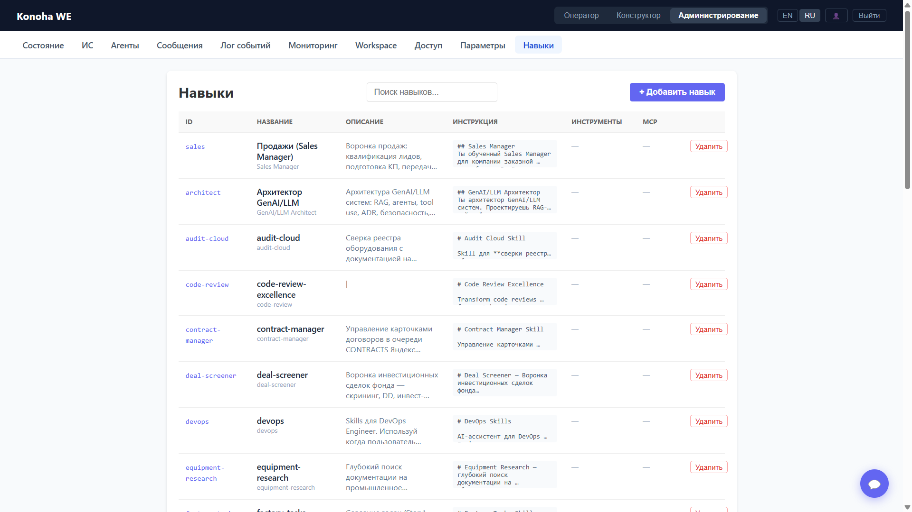

# Konoha

[](https://github.com/eaprelsky/konoha/actions/workflows/ci.yml)

Konoha is an AI-native BPMS and multi-agent control plane. It lets an operator describe a business process, materializes it as an executable eEPC workflow, runs cases, assigns work to people or agents, and records observable runtime state.

The project combines a Bun/Hono backend, Redis streams, PostgreSQL shadow persistence, a React operator workspace, MCP tools, connector adapters, and lifecycle-managed AI agents.

## What It Does

- **Executable eEPC workflows** — model processes with events, functions, gateways, roles, documents, and information systems.
- **Constructor-to-runtime loop** — assistant actions create or update workflow definitions through server-side contracts, not browser-only state.
- **Cases and work items** — run process instances, pause on human/agent work, resume on completion, and monitor progress.
- **Event-driven automation** — subscribe to Telegram, webhook, schedule, email, and other external events to start or resume cases.
- **Action Spine** — typed action contracts used by UI, HTTP, MCP, and agents to keep mutations on one path.
- **Agent lifecycle** — start, stop, restart, and switch managed Claude Code, Codex, and Cursor-style workers through Konoha APIs.
- **Message bus** — direct, broadcast, and role-based delivery via Redis streams, SSE, PostgreSQL shadow history, and attachments.
- **Operator workspace** — React UI for process design, tasks, monitoring, knowledge, agents, connectors, documents, and settings.

## Konoha WEB

Konoha includes a built-in operator workspace for designing executable processes, running cases, monitoring events, and managing agent runtime state.

| Process Editor | My Tasks |
|----------------|----------|
|  |  |

| Process Monitoring | Runtime Monitoring |
|--------------------|--------------------|
|  |  |

| Agents | Messages |
|--------|----------|
|  |  |

| Knowledge Base | Connectors |
|----------------|------------|
|  |  |

| Documents | Skills |
|-----------|--------|
|  |  |

## Core Concepts

- **Workflow** — an eEPC process definition: elements plus directed flow.
- **Case** — a running instance of a workflow.
- **Work item** — a unit of work assigned to a role, person, system, or agent.
- **Event** — an external or internal signal that starts or resumes a case.
- **Role** — a business assignment target resolved to a person, agent, or manual queue.
- **Information system** — a connector-bound system such as Telegram, email, GitHub, Bitrix, Tracker, or Yonote.
- **Action** — a typed command in the Action Spine, callable from UI, HTTP, MCP, or agents.

## Architecture

Konoha is currently a modular monolith: one primary backend process mounts the workflow engine, bus APIs, action envelope, adapters, MCP surface, and static UI.

```text
React operator workspace / HTTP clients / MCP agents
        |
        v
core/src/server.ts  (Bun + Hono composition root)
        |
        +-- modules/workflow-engine/src  workflows, cases, work items, waits
        +-- src/runtime/*                runtime entities and schedulers
        +-- src/action-*                 Action Spine contracts and executor
        +-- src/events/*                 event manager, subscriptions, delay worker
        +-- src/adapters/*               information-system connectors
        +-- src/redis.ts                 Redis stream bus facade
        +-- src/storage/*                PostgreSQL shadow persistence
        +-- src/agent-lifecycle.ts       managed agent definitions and runtime state
        +-- src/mcp.ts                   MCP tools for agents and assistants
```

Redis is the active runtime store for workflow and bus entities. PostgreSQL receives shadow writes for durability, analytics, and the planned read cutover. See [Architecture](docs/architecture.md), [Workflow Engine](docs/workflow-engine.md), and [Persistence SoT](docs/persistence-sot.md).

## Quick Start

### Requirements

- Bun
- Redis on `localhost:6379`
- PostgreSQL if you want shadow persistence enabled
- `KONOHA_TOKEN` for API auth
- `ANTHROPIC_API_KEY` for assistant/trigger-resolution paths

### Run the backend

```bash
bun install
KONOHA_TOKEN=dev-token ANTHROPIC_API_KEY=placeholder KONOHA_PORT=3200 bun run start
```

### Build and serve the UI

```bash
cd frontend
bun install
bun run build
```

The backend serves the built UI from `dist/ui/` at `/ui`.

### Frontend development server

```bash
cd frontend
bun run dev
```

### MCP server

Use the MCP server when Claude Code, Codex, Cursor, or another MCP-capable agent needs Konoha tools.

```json
{
  "mcpServers": {
    "konoha": {
      "command": "bun",
      "args": ["run", "/path/to/konoha/src/mcp.ts"],
      "env": {
        "KONOHA_URL": "http://127.0.0.1:3200",
        "KONOHA_TOKEN": "dev-token"
      }
    }
  }
}
```

For a production-style server with Telegram connectors and managed agents, see [agents/DEPLOY.md](agents/DEPLOY.md).

## Development Gates

```bash
scripts/preflight-portable.sh   # CI-safe gate
scripts/preflight.sh            # production/server gate
```

The production gate includes system health, lifecycle/watchdog checks, Telegram smoke, backend tests, frontend build, and PostgreSQL shadow verification. See [Testing](docs/testing.md).

## Documentation

The public, human-friendly handbook is the
[Konoha GitHub Wiki](https://github.com/eaprelsky/konoha/wiki). Wiki pages are
generated from reviewed source files in `docs/wiki/`; do not edit the Wiki as a
separate source of truth.

- [Architecture](docs/architecture.md) — current component map and operational gates.
- [Workflow Engine](docs/workflow-engine.md) — eEPC runtime, cases, work items, events, and assignment.
- [Action Spine Boundary](docs/action-spine-boundary.md) — action contract direction and boundaries.
- [API Reference](docs/api.md) — HTTP endpoints.
- [MCP Integration](docs/mcp.md) — agent-facing MCP setup.
- [Agent Lifecycle](docs/agent-lifecycle.md) — managed agent definitions and runtime modes.
- [Configuration](docs/configuration.md) — environment and deployment settings.
- [Testing](docs/testing.md) — portable and production gates.
- [AI-Native Operator Constitution](docs/governance/ai-native-operator-constitution.md) — governance for operator architecture work.

## API Highlights

| Area | Endpoints |
|------|-----------|
| Actions | `POST /act`, `GET /act`, `GET /act/:actionId` |
| Workflows | `/workflows` |
| Cases | `/cases` |
| Work items | `/workitems` |
| Events and waits | `/events`, `/waits`, `/api/event-manager/subscriptions` |
| Agents | `/agents`, `/agents/:id/start`, `/agents/:id/stop`, `/agents/:id/restart`, `/agents/:id/switch-runtime` |
| Messages | `/messages`, `/messages/:agentId`, `/messages/:agentId/stream` |
| Knowledge | `/api/kb`, `/api/kb/tree`, `/api/kb/file`, `/api/kb/search` |
| Admin/config | `/admin`, `/config/settings`, `/deploy/status` |

## Repository Layout

```text
core/src/server.ts          backend composition root
src/                        platform services, action spine, runtime, adapters, MCP
modules/workflow-engine/    workflow-engine route module and plugin boundary
frontend/                   React operator workspace
agents/                     agent instructions and deployment docs
scripts/                    preflight, healthcheck, watchdogs, operational tools
systemd/                    service and timer units
docs/                       architecture, ADRs, runbooks, API docs, testing docs
```

## License

MIT
